# yoctoとpoky

## Yoctoとは
Yoctoプロジェクトは 

* <span style="color:red">**特定の実行環境**</span> 向けに
* <span style="color:red">**カスタマイズしたlinuxOS**</span> を

ビルドするための開発環境です


例えば以下のようなことができます

* Raspberry pi向けに`カスタマイズしたlinuxOS`をビルドし、Raspberry piボード上で動かす
* QEMU向けに`カスタマイズしたlinuxOS`をビルドし、QEMUで動かす
* Docker向けに`カスタマイズしたlinuxOS`をビルドし、Dockerコンテナとして動かす
* pythonを実行できる必要最小限のソフトウェアのみインストールしたlinux OSをビルドする  
* ↑のOS上で動かすソフトウェアをビルドするためのSDKをビルドする  
* カスタマイズしたlinux OSやそのSDKをビルドする環境を配布する

</br>

## pokyとは
pokyはyoctoをサンプル実装したリポジトリです。pokyには以下の2種類のファイルが入っています。  

* bitbakeコマンド
* 設定ファイル

ただし、 **この設定ファイルはサンプル実装です。** 多くのユーザーはこの設定ファイルをカスタマイズすることになります  
これらのファイルを使って以下のようにビルドします  

```bash
# サンプルのカスタマイズしたlinux OS(core-image-minimal)をビルドするコマンドの例
$ bitbake core-image-minimal

# サンプルのSDK(meta-toolchain)をビルドするコマンドの例
$ bitbake meta-toolchain
```

  

サンプルのRuntime(=core-image-minimal)やサンプルのSDK(=meta-toolchain)の詳細は、設定ファイルが定義しています  

## pokyのディレクトリ構成
現時点で必要な粒度でpokyのディレクトリ構成を確認します  




実際にpokyのディレクトリ構成を確認してみましょう  
使用するブランチは[こちら](https://wiki.yoctoproject.org/wiki/Releases)から選んでください。ここでは{{YOCTO_BRANCH}}ブランチを選択しています  

~~~bash
$ git clone https://git.yoctoproject.org/git/poky -b {{YOCTO_BRANCH}}
$ tree -L 1
.
├── LICENSE                                                  ┐
├── LICENSE.GPL-2.0-only                                     |
├── LICENSE.MIT                                              |
├── MAINTAINERS.md                                           |
├── MEMORIAM                                                 ├  ライセンスファイル等。上のディレクトリ構成では省略しています
├── Makefile                                                 |
├── README.OE-Core.md                                        |
├── README.hardware.md -> meta-yocto-bsp/README.hardware.md  |
├── README.md -> README.poky.md                              |
├── README.poky.md -> meta-poky/README.poky.md               |
├── README.qemu.md                                           ┘
├── bitbake                                                  <- bitbakeコマンド(を提供しているディレクトリ)
├── build                                                    <- ビルド用のワーキングディレクトリ
├── contrib                                                  ┐
├── documentation                                            │
├── meta                                                     │
├── meta-poky                                                ├  設定ファイル
├── meta-selftest                                            │
├── meta-skeleton                                            │
├── meta-yocto-bsp                                           ┘
├── oe-init-build-env                                        <- ビルド環境を設定するスクリプト
└── scripts

10 directories, 12 files
~~~

ライセンスファイルやシンボリックリンク、.git等不要ファイルを削除して整理します  

~~~bash
$ tree -L 1
.
├── bitbake            <- bitbakeコマンド(を提供しているディレクトリ)
├── build              <- ビルド用のワーキングディレクトリ
├── contrib            ┐
├── meta               │
├── meta-poky          ├  設定ファイル
├── meta-selftest      │
├── meta-skeleton      │
├── meta-yocto-bsp     ┘
├── oe-init-build-env  <- ビルド環境を設定するスクリプト
└── scripts
~~~

概ね先に示した図の通りのディレクトリ構造になっていることが分かります  
