# yoctoとpoky

!!! note

    このドキュメントでは是非コードブロックのコマンドを実行してください  
    後述するレイヤやレシピ、パッケージを理解するには自分で操作することが確実だからです  

## Yoctoとは
Yoctoプロジェクトは 

* <span style="color:red">**特定の実行環境(開発用ボードなど)**</span> 向けに
* <span style="color:red">**カスタマイズしたlinuxOS**</span> を

ビルドするための開発環境です。例えば以下のようなことができます

* Raspberry pi向けに`カスタマイズしたlinuxOS`をビルドし、Raspberry piボード上で動かす
* QEMU向けに`カスタマイズしたlinuxOS`をビルドし、QEMUで動かす
* Docker向けに`カスタマイズしたlinuxOS`をビルドし、Dockerコンテナとして動かす
* pythonを実行できる必要最小限のソフトウェアのみインストールしたlinux OSをビルドする  
* ↑のOS上で動かすソフトウェアをビルドするためのSDKをビルドする  
* カスタマイズしたlinux OSやそのSDKをビルドする環境を配布する

</br>

## pokyとは
pokyはyoctoの実装リポジトリです。 pokyの主な構成要素はレイヤとレシピです  
pokyとレイヤ、レシピは以下のような関係になっています  




## pokyのディレクトリ構成
pokyとレイヤ、レシピの関係を念頭に、実際にpokyディレクトリに何が入っているのかを観察します  
使用するブランチは[こちら](https://wiki.yoctoproject.org/wiki/Releases)から選んでください。ここでは{{YOCTO_BRANCH}}ブランチを選択しています  

~~~bash
$ git clone https://git.yoctoproject.org/git/poky -b {{YOCTO_BRANCH}}
$ tree -L 1
.
├── LICENSE                                                  ┐
├── LICENSE.GPL-2.0-only                                     |
├── LICENSE.MIT                                              |
├── MAINTAINERS.md                                           |
├── MEMORIAM                                                 ├  ライセンスファイルなど
├── Makefile                                                 |
├── README.OE-Core.md                                        |
├── README.hardware.md -> meta-yocto-bsp/README.hardware.md  |
├── README.md -> README.poky.md                              |
├── README.poky.md -> meta-poky/README.poky.md               |
├── contrib                                                  |
├── README.qemu.md                                           ┘
├── documentation                                            <- ドキュメント。基本オンラインドキュメントと同じだが、+αの記載もある
├── bitbake                                                  <- bitbakeというビルドコマンドを実装しているディレクトリ
├── meta                                                     ┐
├── meta-poky                                                |
├── meta-selftest                                            ├  レイヤ
├── meta-skeleton                                            │
├── meta-yocto-bsp                                           ┘
├── oe-init-build-env                                        <- ビルド環境を設定するスクリプト
└── scripts                                                  <- その他の便利に使えるスクリプト

10 directories, 12 files
~~~

不要なファイルを削除して整理すると以下の3種類しかないことが分かります  

~~~bash
$ tree -L 1
.
├── bitbake            <- bitbakeというビルドコマンドを実装しているディレクトリ
├── meta               ┐
├── meta-poky          |
├── meta-selftest      ├  レイヤ
├── meta-skeleton      │
├── meta-yocto-bsp     ┘
└── oe-init-build-env  <- ビルド環境を設定するスクリプト
~~~

それぞれ概要を見ていきましょう

</br>

## oe-init-build-env
yoctoをビルドする環境を設定するスクリプトです。主に以下の処理を実施します  

* 必要な環境変数を設定する
* ビルドディレクトリを作成する
* カレントディレクトリをビルドディレクトリに移動する
* bitbakeコマンドやその他便利なスクリプトにパスを通す

</br>

## bitbake
yocto固有のビルドコマンド(bitbake)を実装しているディレクトリです  
bitbakeコマンドはcmakeやninjaとよく似た機能を提供しています。例えば以下のように使用します  

```bash
$ source oe-init-build-env  # oe-init-build-envでビルド環境をセットアップする
$ bitbake python3           # bitbakeコマンドでビルドする
```

</br>

## レイヤ
まずはレイヤの中にどのようなファイルが含まれるのかを観察します  

```
$ cd meta-poky
$ tree 
.
├── README.poky.md         <- ただのREADME
├── classes                <- 今は無視してください
├── conf                   <- 今は無視してください
└── recipes-core
    ├── busybox            ┐
    ├── psplash            ├  ソフトウェアの名前のディレクトリ。レシピファイルが入っている
    └── tiny-init          ┘
        ├── files          <- 今は無視してください
        └── tiny-init.bb   <- レシピファイル。ビルドのパラメータ(リポジトリのURIなど)を定義している

12 directories, 23 files
```


`*.bb` というファイルがレシピと呼ばれるファイルです  
現時点では `レイヤ=レシピを格納するディレクトリ` と思っておいてください  


<!--

これらのファイルを使って以下のようにビルドします  
(コマンドの実行には[ビルド環境をセットアップし、サンプルOSをビルドする](./01-build-sample-os.md)で説明する準備が必要です)  

```bash
# サンプルのカスタマイズしたlinux OS(core-image-minimal)をビルドするコマンドの例
$ bitbake core-image-minimal

# サンプルのSDK(meta-toolchain)をビルドするコマンドの例
$ bitbake meta-toolchain
```

  

サンプルのRuntime(=core-image-minimal)やサンプルのSDK(=meta-toolchain)の詳細は、設定ファイルが定義しています  

# 実際のpokyディレクトリを観察する
-->

## レシピ
実際にレシピファイルの中身を見てみましょう  
(理解しやすくするため、一部ファイルを編集しています)  

```
$ cd meta-skeleton/recipes-skeleton/hello-single
$ cat hello_1.0.bb
DESCRIPTION = "Simple helloworld application"
LICENSE = "MIT"

PN = "hello"

SRC_URI = " \
    git://github.com/ab/cd.git;branch=main \
    file://helloworld.c \
"

do_compile() {
        ${CC} ${LDFLAGS} helloworld.c -o helloworld
}

do_install() {
        install -d ${D}${bindir}
        install -m 0755 helloworld ${D}${bindir}
}
```

最も需要なのは `PN` 変数です。 これは `パッケージ` を宣言しています  
同じレシピ内の他の記述はこのパッケージのパラメータを宣言しています  
また、この `パッケージ` がbitbakeのビルド対象です  



!!! note

    この説明ではレシピとパッケージが1:1の関係にあるように感じられると思います  
    詳しくは別のページで説明しますが、1つのレシピの中で複数のパッケージを宣言することが可能です  

!!! note

    このページではbitbakeのビルド単位としてパッケージを説明しました  
    インストール単位(PACKAGES/RPROVIDES)としてパッケージという言葉を使うこともありますが、混乱を招くためここでは説明しません  


## レシピとパッケージ
