# yoctoとpoky

!!! note

    このドキュメントでは是非コードブロックのコマンドを実行してください  
    後述するレイヤやレシピ、パッケージを理解するには自分で操作することが確実だからです  

## Yoctoとは
Yoctoプロジェクトは 

* <span style="color:red">**特定の実行環境**</span> 向けに
* <span style="color:red">**カスタマイズしたlinuxOS**</span> を

ビルドするための開発環境です


例えば以下のようなことができます

* Raspberry pi向けに`カスタマイズしたlinuxOS`をビルドし、Raspberry piボード上で動かす
* QEMU向けに`カスタマイズしたlinuxOS`をビルドし、QEMUで動かす
* Docker向けに`カスタマイズしたlinuxOS`をビルドし、Dockerコンテナとして動かす
* pythonを実行できる必要最小限のソフトウェアのみインストールしたlinux OSをビルドする  
* ↑のOS上で動かすソフトウェアをビルドするためのSDKをビルドする  
* カスタマイズしたlinux OSやそのSDKをビルドする環境を配布する

</br>

## pokyとは
pokyはyoctoをサンプル実装したリポジトリです。実際にpokyに何が入っているのかを観察しましょう  
使用するブランチは[こちら](https://wiki.yoctoproject.org/wiki/Releases)から選んでください。ここでは{{YOCTO_BRANCH}}ブランチを選択しています  

~~~bash
$ git clone https://git.yoctoproject.org/git/poky -b {{YOCTO_BRANCH}}
$ tree -L 1
.
├── LICENSE                                                  ┐
├── LICENSE.GPL-2.0-only                                     |
├── LICENSE.MIT                                              |
├── MAINTAINERS.md                                           |
├── MEMORIAM                                                 ├  ライセンスファイルなど
├── Makefile                                                 |
├── README.OE-Core.md                                        |
├── README.hardware.md -> meta-yocto-bsp/README.hardware.md  |
├── README.md -> README.poky.md                              |
├── README.poky.md -> meta-poky/README.poky.md               |
├── contrib                                                  |
├── README.qemu.md                                           ┘
├── documentation                                            <- ドキュメント。基本オンラインドキュメントと同じだが、+αの記載もある
├── bitbake                                                  <- bitbakeというビルドコマンドを実装しているディレクトリ
├── meta                                                     ┐
├── meta-poky                                                |
├── meta-selftest                                            ├  レイヤ(後述)
├── meta-skeleton                                            │
├── meta-yocto-bsp                                           ┘
├── oe-init-build-env                                        <- ビルド環境を設定するスクリプト
└── scripts                                                  <- その他の便利に使えるスクリプト

10 directories, 12 files
~~~

不要なファイルを削除して整理すると以下の3種類しかないことが分かります  

~~~bash
$ tree -L 1
.
├── bitbake            <- bitbakeというビルドコマンドを実装しているディレクトリ
├── meta               ┐
├── meta-poky          |
├── meta-selftest      ├  レイヤ(後述)
├── meta-skeleton      │
├── meta-yocto-bsp     ┘
└── oe-init-build-env  <- ビルド環境を設定するスクリプト
~~~

以下、それぞれの概要を見ていきましょう

</br>

## oe-init-build-env
yoctoをビルドする環境を設定するスクリプトです。主に以下の処理を実施します  
(複雑なことをしない限り、詳細を把握する必要はありません)  

* 必要な環境変数を設定する
* ビルドディレクトリを作成する
* カレントディレクトリをビルドディレクトリに移動する
* bitbakeコマンドやその他便利なスクリプトにパスを通す


</br>

## bitbake
yocto固有のビルドコマンドです  
cmakeやninjaとよく似た機能を提供しています。例えば以下のように使用します  

```
# oe-init-build-envでビルド環境をセットアップする
$ source oe-init-build-env 
# bitbakeコマンドでビルドする
$ bitbake python3
```

上の例の通りbitbakeコマンドはビルド対象を引数で受け取ります  
このビルド対象のことを<span style="color:red">**パッケージ**</span>と呼びます  

</br>


## レイヤ

<!--

これらのファイルを使って以下のようにビルドします  
(コマンドの実行には[ビルド環境をセットアップし、サンプルOSをビルドする](./01-build-sample-os.md)で説明する準備が必要です)  

```bash
# サンプルのカスタマイズしたlinux OS(core-image-minimal)をビルドするコマンドの例
$ bitbake core-image-minimal

# サンプルのSDK(meta-toolchain)をビルドするコマンドの例
$ bitbake meta-toolchain
```

  

サンプルのRuntime(=core-image-minimal)やサンプルのSDK(=meta-toolchain)の詳細は、設定ファイルが定義しています  

# 実際のpokyディレクトリを観察する
-->

## レシピ

## レシピとパッケージ
