# yocto/poky/bitbake

## Yoctoとは
Yoctoプロジェクトは、以下の2つをビルドするための開発環境です  

* `カスタマイズしたlinuxOSのRuntime`  
* `Runtime用のSDK`  

例えば、以下のような使い方ができます  

* pythonを実行できる必要最小限のソフトウェアのみインストールしたlinux OSのRuntimeをビルドする  
* ↑のOS上で動かすソフトウェアをビルドするためのSDKをビルドする  
* カスタマイズしたlinux OSやそのSDKをビルドする環境を配布する。受け取った人はさらにカスタマイズしてビルドする  

 

## pokyとは
pokyは、yoctoをサンプル実装したリポジトリです。 pokyによるビルドを分解すると以下の図になります  

  

このページの以下では以下の2点を説明します  

* pokyのディレクトリ構成
* (pokyに含まれる)bitbakeコマンド

### pokyのディレクトリ構成
現時点で必要な粒度でpokyのディレクトリ構成を確認します。  

!!! NOTE

    出力されるファイル名は設定ファイルによって大きく変化します  

実際にpokyのディレクトリ構成を確認してみましょう  
使用するブランチは[こちら](https://wiki.yoctoproject.org/wiki/Releases)から選んでください。ここでは{{YOCTO_BRANCH}}ブランチを選択しています  

~~~bash
$ git clone https://git.yoctoproject.org/git/poky -b {{YOCTO_BRANCH}}
$ tree -L 1
.
├── LICENSE                                                  ┐
├── LICENSE.GPL-2.0-only                                     |
├── LICENSE.MIT                                              |
├── MAINTAINERS.md                                           |
├── MEMORIAM                                                 ├  ライセンスファイル等。上のディレクトリ構成では省略しています
├── Makefile                                                 |
├── README.OE-Core.md                                        |
├── README.hardware.md -> meta-yocto-bsp/README.hardware.md  |
├── README.md -> README.poky.md                              |
├── README.poky.md -> meta-poky/README.poky.md               |
├── README.qemu.md                                           ┘
├── bitbake                                                  <- bitbakeコマンド(を提供しているディレクトリ)
├── build                                                    <- この中に `カスタマイズしたlinuxOSのRuntime` や `Runtime用のSDK` が出力される
├── contrib                                                  ┐
├── documentation                                            │
├── meta                                                     │
├── meta-poky                                                ├  設定ファイル
├── meta-selftest                                            │
├── meta-skeleton                                            │
├── meta-yocto-bsp                                           ┘
├── oe-init-build-env                                        <- ビルド環境を設定するスクリプト
└── scripts

10 directories, 12 files
~~~

ライセンスファイルやシンボリックリンク、.git等不要ファイルを削除して整理します  

~~~bash
$ tree -L 1
.
├── bitbake            <- bitbakeコマンド(を提供しているディレクトリ)
├── build              <- この中にRuntimeとSDKがある
├── contrib            ┐
├── meta               │
├── meta-poky          ├  設定ファイル
├── meta-selftest      │
├── meta-skeleton      │
├── meta-yocto-bsp     ┘
├── oe-init-build-env  <- ビルド環境を設定するスクリプト
└── scripts
~~~

先に示した図の通りのディレクトリ構造になっていることが分かります  

### bitbakeコマンド

#### パッケージとは

  

先に紹介した上図のとおり、bitbakeコマンドは引数で指定された対象をビルドします  
例えばcore-image-minimalというサンプルOSの場合、↓のようにビルドできます  

~~~bash
$ bitbake core-image-minimal
~~~

このようにbitbakeコマンドがビルド対象とするものを**パッケージ**と呼びます。上の図の場合、`core-image-minimal`がパッケージ名ですね  

 

実は、パッケージには`カスタマイズしたlinuxOSのRuntime` や `Runtime用のSDK` ではない普通のソフトウェアも存在します  
普通のソフトウェアのパッケージをビルドした場合、以下のようにインストーラが出力されます  

  

例えば、python3やbusyboxはパッケージです。 したがって、ビルド環境の設定をすれば以下のコマンドでビルドできます   

~~~bash
$ bitbake python3 # python3をビルドする
$ bitbake busybox # busyboxをビルドする
~~~

#### パッケージ間の依存関係

あるパッケージをビルドする際、別のソフトウェアを必要とすることがあります  
例えば、python3(cPython3)をビルドする場合、以下のようなソフトウェアが必要です  

* ビルドのtoolchain  
    python3(cPython3)はCで開発されているためビルドにCコンパイラなどのtoolchainが必要です  
* 外部のライブラリ等  
    python3はsqlite3などの外部ライブラリを静的リンクしている(と思う)ので、ビルドにはこれらのライブラリが必要です  

これらはhostにinstall済みのものを使用することもできますが、ビルドする環境によって結果が異なってしまいます  
この問題を解決するために、**あるパッケージをビルドする時、ビルドに必要なソフトウェアのパッケージをbitbakeが検出してビルドしてくれます**  

つまり、以下の図のようにあるパッケージをbitbakeでビルドすると必要なパッケージが芋づる式にビルドされます  

!!! WARNING

    依存関係にはビルド時の依存関係と実行時の依存関係があるのですが、ここではあまり詳しく説明しません  

