# yocto/poky/bitbake

## Yoctoとは
Yoctoプロジェクトは以下をビルドするための開発環境です  

* `カスタマイズしたlinuxOSのRuntime`  
* `Runtime用のSDK`  




例えば、以下のような使い方ができます  

* pythonを実行できる必要最小限のソフトウェアのみインストールしたlinux OSのRuntimeをビルドする  
* ↑のOS上で動かすソフトウェアをビルドするためのSDKをビルドする  
* カスタマイズしたlinux OSやそのSDKをビルドする環境を配布する。受け取った人はさらにカスタマイズしてビルドする  

</br>

## pokyとは
pokyはyoctoをサンプル実装したリポジトリです。pokyには以下の2種類のファイルが入っています。  

* bitbakeコマンド
* 設定ファイル

ただし、 **この設定ファイルはサンプル実装です。** つまり、pokyの設定ファイルを使わずに0から設定ファイルを作ることもできます  
(そのようなことをしているプロジェクトはみたことがないですが)  

これらのファイルを使って以下のようにビルドします  
ここではbitbakeコマンドのことは気にしないでください。あとで出てきます  

```bash
# サンプルのカスタマイズしたlinux OSのruntimeをビルドするコマンドの例
$ bitbake core-image-minimal

# サンプルのRuntime用のSDKをビルドするコマンドの例
$ bitbake meta-toolchain
```

  

サンプルのRuntime(=core-image-minimal)やサンプルのSDK(=meta-toolchain)の詳細は、設定ファイルが定義しています  

<!--
### pokyのディレクトリ構成
現時点で必要な粒度でpokyのディレクトリ構成を確認します。  



!!! NOTE

    出力されるファイル名は設定ファイルによって大きく変化します  

実際にpokyのディレクトリ構成を確認してみましょう  
使用するブランチは[こちら](https://wiki.yoctoproject.org/wiki/Releases)から選んでください。ここでは{{YOCTO_BRANCH}}ブランチを選択しています  

~~~bash
$ git clone https://git.yoctoproject.org/git/poky -b {{YOCTO_BRANCH}}
$ tree -L 1
.
├── LICENSE                                                  ┐
├── LICENSE.GPL-2.0-only                                     |
├── LICENSE.MIT                                              |
├── MAINTAINERS.md                                           |
├── MEMORIAM                                                 ├  ライセンスファイル等。上のディレクトリ構成では省略しています
├── Makefile                                                 |
├── README.OE-Core.md                                        |
├── README.hardware.md -> meta-yocto-bsp/README.hardware.md  |
├── README.md -> README.poky.md                              |
├── README.poky.md -> meta-poky/README.poky.md               |
├── README.qemu.md                                           ┘
├── bitbake                                                  <- bitbakeコマンド(を提供しているディレクトリ)
├── build                                                    <- この中に `カスタマイズしたlinuxOSのRuntime` や `Runtime用のSDK` が出力される
├── contrib                                                  ┐
├── documentation                                            │
├── meta                                                     │
├── meta-poky                                                ├  設定ファイル
├── meta-selftest                                            │
├── meta-skeleton                                            │
├── meta-yocto-bsp                                           ┘
├── oe-init-build-env                                        <- ビルド環境を設定するスクリプト
└── scripts

10 directories, 12 files
~~~

ライセンスファイルやシンボリックリンク、.git等不要ファイルを削除して整理します  

~~~bash
$ tree -L 1
.
├── bitbake            <- bitbakeコマンド(を提供しているディレクトリ)
├── build              <- この中にRuntimeとSDKがある
├── contrib            ┐
├── meta               │
├── meta-poky          ├  設定ファイル
├── meta-selftest      │
├── meta-skeleton      │
├── meta-yocto-bsp     ┘
├── oe-init-build-env  <- ビルド環境を設定するスクリプト
└── scripts
~~~

先に示した図の通りのディレクトリ構造になっていることが分かります  
-->
