# packageについて

## パッケージとは

先に紹介したとおり、bitbakeコマンドは引数で指定された対象をビルドします。 例えばpython3の場合、↓のようにビルドできます  
(予め [ビルド環境をセットアップし、サンプルOSをビルドする](../01-yocto-and-poky/01-build-sample-os.md) を参照してビルド環境をセットアップしてください)

~~~bash
$ bitbake python3
~~~

このように **bitbakeコマンドがビルド対象とするもの を パッケージ と呼びます。** 上の図の場合、`python3`がパッケージですね  
パッケージにはサンプルのカスタマイズしたlinux OSのRuntimeや、そのRuntime用のSDKも存在します。 

~~~bash
$ bitbake core-image-minimal
$ bitbake meta-toolchain
~~~

!!! warning

    yoctoでよく `パッケージ` と呼ばれるものには厳密には2つの種類が存在します  
    一つはビルド対象としての単位(PN)であり、もう一つがインストール対象(RPROVIDES)としての単位です  
    このドキュメントを読んでいる段階でこれらの違いを意識する必要はないため、説明は割愛します  

## パッケージ間の依存関係

あるパッケージをビルドする際、別のソフトウェアを必要とすることがあります  
例えば、python3(cPython3)をビルドする場合、以下のようなソフトウェアが必要です  

* ビルドのtoolchain  
    python3(cPython3)はCで開発されているためビルドにCコンパイラなどのtoolchainが必要です  
* 外部のライブラリ等  
    python3はsqlite3などの外部ライブラリを静的リンクしている(と思う)ので、ビルドにはこれらのライブラリが必要です  

install済みのこれらのパッケージを使用すると、ビルド環境によってビルド結果が異なってしまいます  
この問題を解決するために、**あるパッケージをビルドする時、ビルドに必要なソフトウェアのパッケージをbitbakeが検出して自動的にビルドします**  

つまり、以下の図のようにあるパッケージをbitbakeでビルドすると必要なパッケージが芋づる式にビルドされます  
このため、ちょっとしたソフトウェアであってもyoctoでビルドすると時間がかかることがあります  

!!! WARNING

    依存関係にはビルド時の依存関係と実行時の依存関係があるのですが、ここでは詳しく説明しません  

