# pokyの詳細

## pokyのディレクトリ構成
現時点で必要な粒度でpokyのディレクトリ構成を確認します  
レイヤとレシピが集まったものであることが分かりますね  

それぞれどのようなファイル/ディレクトリなのかを説明します  
bitbakeとoe-init-build-envは既に[ビルド環境をセットアップし、サンプルOSをビルドする](../01-yocto-and-poky/01-build-sample-os.md)で使っているので、簡単に説明します

# bitbakeコマンド
[yoctoとpoky](../01-yocto-and-poky/index.md) で解説した通り、ビルドを実行するためのコマンドです。    
具体的な使い方は[ビルド環境をセットアップし、サンプルOSをビルドする](../01-yocto-and-poky/01-build-sample-os.md)を参照してください  

# ビルド環境を設定するスクリプト
[yoctoとpoky](../01-yocto-and-poky/index.md) で解説した通り、ビルド環境をセットアップするためのコマンドです。    
具体的な使い方は[ビルド環境をセットアップし、サンプルOSをビルドする](../01-yocto-and-poky/01-build-sample-os.md)を参照してください  

# レイヤ
レイヤとは、レシピと呼ばれる設定ファイルをまとめて管理しているディレクトリです  

# レシピ

# 実際のpokyディレクトリを観察する
<!--

実際にpokyのディレクトリ構成を確認してみましょう  
使用するブランチは[こちら](https://wiki.yoctoproject.org/wiki/Releases)から選んでください。ここでは{{YOCTO_BRANCH}}ブランチを選択しています  

~~~bash
$ git clone https://git.yoctoproject.org/git/poky -b {{YOCTO_BRANCH}}
$ tree -L 1
.
├── LICENSE                                                  ┐
├── LICENSE.GPL-2.0-only                                     |
├── LICENSE.MIT                                              |
├── MAINTAINERS.md                                           |
├── MEMORIAM                                                 ├  ライセンスファイル等。上のディレクトリ構成では省略しています
├── Makefile                                                 |
├── README.OE-Core.md                                        |
├── README.hardware.md -> meta-yocto-bsp/README.hardware.md  |
├── README.md -> README.poky.md                              |
├── README.poky.md -> meta-poky/README.poky.md               |
├── README.qemu.md                                           ┘
├── bitbake                                                  <- bitbakeコマンド(を提供しているディレクトリ)
├── build                                                    <- ビルド用のワーキングディレクトリ
├── contrib                                                  ┐
├── documentation                                            │
├── meta                                                     │
├── meta-poky                                                ├  設定ファイル
├── meta-selftest                                            │
├── meta-skeleton                                            │
├── meta-yocto-bsp                                           ┘
├── oe-init-build-env                                        <- ビルド環境を設定するスクリプト
└── scripts

10 directories, 12 files
~~~

ライセンスファイルやシンボリックリンク、.git等不要ファイルを削除して整理します  

~~~bash
$ tree -L 1
.
├── bitbake            <- bitbakeコマンド(を提供しているディレクトリ)
├── build              <- ビルド用のワーキングディレクトリ
├── contrib            ┐
├── meta               │
├── meta-poky          ├  設定ファイル
├── meta-selftest      │
├── meta-skeleton      │
├── meta-yocto-bsp     ┘
├── oe-init-build-env  <- ビルド環境を設定するスクリプト
└── scripts
~~~

概ね先に示した図の通りのディレクトリ構造になっていることが分かります  

-->