## このページのスコープ

[yocto/poky/bibbake](../01-yocto-poky-bitbake/study.md)では、yoctoについて下図のように理解しました  
特に、bitbakeコマンドの 対象のパッケージ名 以外のinputを`設定ファイル`としてざっくり理解しました  

このページでは、この`設定ファイル`をもう少し詳細に分解し、その一部のレシピファイルを学習します  

## 設定ファイル

#### 構成要素

設定ファイルは**主に**以下の要素で構成されます  

* レイヤ  
* レシピファイル  
* コンフィグファイル  

#### ディレクトリ構成

[yocto/poky/bibbake](../01-yocto-poky-bitbake/study.md)で勉強したのディレクトリ構成は以下の通りです  

 

これに`レイヤ`と`レシピファイル`をあてはめます。 `コンフィグファイル`は今知る必要がないためこのページでは省略します  
まず、先の図に`レイヤ`をあてはめます  

`other directories` として大雑把にくくっていたディレクトリがレイヤの集合であることがわかりました   
`レイヤ`の中に`レシピファイル`が存在するので、次はレイヤを分解してみましょう  

図を見れば分かりますが、**レイヤはレシピファイルをまとめて管理しているディレクトリです**  
また、多くの場合、パッケージ毎に関連するファイルをまとめて一つのディレクトリに配置しています  
`レシピ以外のレイヤ内のファイル` と `レシピファイル以外のパッケージに関連するファイル` のことは一旦無視してかまいません  

#### レシピファイル
パッケージのパラメータ(リポジトリのURL等)を定義するファイルです。 単にレシピと呼ぶこともあります   

alsa-libパッケージのレシピを見てみましょう  
レシピを探す方法には`bitbake-getvar`や`bitbake -e`などツールを使う方法がありますが、今回はfindコマンドで探します   
特定のパッケージのレシピファイルをfindコマンドで探す場合、以下のルールを手がかりにすると良いかもしません   

* 拡張子は.bb
* ファイル名はパッケージ名を含むことが多い。例えば、`パッケージ名_バージョン.bb`(**多数の例外あり**)
* 多くのレシピファイルは`meta`という接頭辞がついたディレクトリの中に存在する(**多数の例外あり**)

~~~bash
$ find ./meta* -name "alsa-lib*"
./meta/recipes-multimedia/alsa/alsa-lib_1.2.7.2.bb
~~~

見つけたレシピファイルをcatコマンドで確認してみます  

~~~bash
$ cat ./meta/recipes-multimedia/alsa/alsa-lib_1.2.7.2.bb
SUMMARY = "ALSA sound library"
DESCRIPTION = "(Occasionally a.k.a. libasound) is a userspace library that \
provides a level of abstraction over the /dev interfaces provided by the kernel modules."
HOMEPAGE = "http://www.alsa-project.org"
BUGTRACKER = "http://alsa-project.org/main/index.php/Bug_Tracking"
SECTION = "libs/multimedia"
LICENSE = "LGPL-2.1-only & GPL-2.0-or-later"
LIC_FILES_CHKSUM = "file://COPYING;md5=a916467b91076e631dd8edb7424769c7 \
                    file://src/socket.c;md5=285675b45e83f571c6a957fe4ab79c93;beginline=9;endline=24 \
                    "

SRC_URI = "https://www.alsa-project.org/files/pub/lib/${BP}.tar.bz2"
SRC_URI[sha256sum] = "8a35b7218e50f2a2c79342d0de98ded81439ce19e12809385ec9be9596de7c2f"
// 以下略
~~~

`パッケージのサマリ`や`ライセンスの情報`、`リポジトリのURI`など、パッケージ固有の設定を定義していることが分かります  
このようにレシピファイルはパッケージ毎の情報を定義します  

#### incファイル
`レシピファイル以外のパッケージに関連するファイル` の一部に、incファイルというファイルが存在します  
レシピファイルが参照するファイルであり、レシピファイルは `include` あるいは `require` でincファイルを読み込み、内容をその場所に挿入します  

acpidパッケージがちょうどよさそうなので、このパッケージを具体例として見てみましょう  
まずはacpidパッケージのファイルパスと、そこにどのようなファイルが存在するのかをみてみます  

~~~bash
$ find ./* -name acpid*.bb
./meta/recipes-bsp/acpid/acpid_2.0.33.bb
$ ll ./meta/recipes-bsp/acpid
合計 20
drwxrwxr-x  3 4096  8月 14 12:19 ./
drwxrwxr-x 21 4096  8月 14 12:19 ../
drwxrwxr-x  2 4096  8月 14 12:19 acpid/
-rw-rw-r--  1 1369  8月 14 12:19 acpid.inc
-rw-rw-r--  1 266   8月 14 12:19 acpid_2.0.33.bb
~~~

次にacpidパッケージのレシピファイルの中身を確認しましょう  

~~~bash
$ cat ./meta/recipes-bsp/acpid/acpid_2.0.33.bb
require acpid.inc

LIC_FILES_CHKSUM = "file://COPYING;md5=8ca43cbc842c2336e835926c2166c28b \
                    file://acpid.h;endline=24;md5=324a9cf225ae69ddaad1bf9d942115b5"

SRC_URI[sha256sum] = "0856f71b3eb34a1b663d0a8e6363dfcbc519e63d847330498898658e2972dbe8"
~~~

ファイル先頭で`require`句を使ってincファイルを参照していますね。 incファイルの中身を確認してみます  

~~~bash
$ cat ./meta/recipes-bsp/acpid/acpid.inc 
SUMMARY = "A daemon for delivering ACPI events"
DESCRIPTION = "ACPID is a completely flexible, totally extensible daemon for \
delivering ACPI events. It listens on netlink interface (or on the \
deprecated file /proc/acpi/event), and when an event occurs, executes programs \
to handle the event. The programs it executes are configured through a set of \
configuration files, which can be dropped into place by packages or by the \
admin."
HOMEPAGE = "http://sourceforge.net/projects/acpid2"
BUGTRACKER = "http://sourceforge.net/p/acpid2/tickets/?source=navbar"
SECTION = "base"
LICENSE = "GPL-2.0-or-later"

// 以下incファイルの中身を省略
~~~

このファイルがacpidパッケージのレシピファイルの先頭でrequireされているため、acpidパッケージのレシピは以下と同等になります  

~~~bash
SUMMARY = "A daemon for delivering ACPI events"
DESCRIPTION = "ACPID is a completely flexible, totally extensible daemon for \
delivering ACPI events. It listens on netlink interface (or on the \
deprecated file /proc/acpi/event), and when an event occurs, executes programs \
to handle the event. The programs it executes are configured through a set of \
configuration files, which can be dropped into place by packages or by the \
admin."
HOMEPAGE = "http://sourceforge.net/projects/acpid2"
BUGTRACKER = "http://sourceforge.net/p/acpid2/tickets/?source=navbar"
SECTION = "base"
LICENSE = "GPL-2.0-or-later"

// 以下incファイルの中身を省略

LIC_FILES_CHKSUM = "file://COPYING;md5=8ca43cbc842c2336e835926c2166c28b \
                    file://acpid.h;endline=24;md5=324a9cf225ae69ddaad1bf9d942115b5"

SRC_URI[sha256sum] = "0856f71b3eb34a1b663d0a8e6363dfcbc519e63d847330498898658e2972dbe8"
~~~