# Yoctoのモデル

## Yoctoとは
Yoctoプロジェクトは、`カスタマイズしたlinuxOSをビルドする`ための開発環境です。  
`カスタマイズしたlinuxOSをビルドする`作業を少し細かく分解すると、以下の図のようになります。   
(あくまで簡単なイメージです)  

  

上図の通り、基本的には`bitbake`というコマンドを使用することになります  

## bitbakeコマンドとパッケージについて
bitbakeコマンドは引数で指定された対象をビルドします。↓のようなイメージですね   

```bash
$ bitbake python3
```

**そして、このbitbakeコマンドがビルド対象するものをパッケージと呼びます**  

具体的なイメージとしてOSイメージ、ソフトウェアやライブラリのことだと思ってください  
例えば、core-image-minimal(yoctoでビルドできるサンプルOSの一つ)、python3やbusyboxはパッケージです  
したがって、ビルド環境の設定をすれば以下のコマンドでそれぞれビルドすることが可能です  

```bash
$ bitbake core-image-minimal
$ bitbake python3
$ bitbake busybox
```

ただし、OSイメージのパッケージをビルドした場合と、普通のソフトウェアのパッケージをビルドした場合ではbitbakeコマンドの出力が異なります  
OSイメージをビルドする場合、先に紹介した図になります  

  

普通のソフトウェアのパッケージをビルドした場合、以下のようにインストーラが出力されます  

  

<!--

## パッケージ間のビルド時の依存関係について

あるパッケージAをビルドする際、別のパッケージBのビルドが必要になることがあります  
例えば、以下のようなケースです

* パッケージAのビルドそのものにツールとして必要(cmakeなど)
* パッケージAのビルド(というより、コンパイル)がパッケージBのライブラリやヘッダファイルを参照している

こういった場合、`bitbake パッケージA`としてパッケージAのビルドを実行すると、自動的にパッケージBのビルドも実行されます  
このような依存関係は再帰的にどこまでも続くので、以下のような依存関係のツリーが存在することになります  


> **NOTE**  
> この図はDFDではありません。矢印はある処理が別の処理をキックする様を表現しています  



-->


## リファレンス実装(poky)について
bitbakeコマンドの入力となる`yocto設定ファイル`は非常に規模が大きく、複雑な実装が必要です　  
このため、`yocto設定ファイル`のリファレンス実装と`環境変数を設定する`スクリプト, `bitbakeコマンド`スクリプトをまとめたpokyというリポジトリが存在します  
大抵の場合、このpokyをカスタマイズすることで実装を行います。   

  

## pokyのディレクトリ構成
現時点で必要な粒度でpokyのディレクトリ構成を確認します。  


> **NOTE**  
> linuxカーネルやrootfsのファイル名はyocto設定ファイルによってかなり変化します  

</br>

> **NOTE**  
> リポジトリをcloneしただけの状態ではbuildディレクトリは存在しません。何等かのパッケージのビルドが必要です  

実際にpokyのディレクトリ構成を確認してみましょう  
使用するブランチは[こちら](https://wiki.yoctoproject.org/wiki/Releases)から選んでください。ここでは{{YOCTO_BRANCH}}ブランチを選択しています  

```bash
$ git clone https://git.yoctoproject.org/git/poky -b {{YOCTO_BRANCH}}
$ tree -L 1
.
├── LICENSE
├── LICENSE.GPL-2.0-only
├── LICENSE.MIT
├── MAINTAINERS.md
├── MEMORIAM
├── Makefile
├── README.OE-Core.md
├── README.hardware.md -> meta-yocto-bsp/README.hardware.md
├── README.md -> README.poky.md
├── README.poky.md -> meta-poky/README.poky.md
├── README.qemu.md
├── bitbake                                                  <- bitbakeコマンド(を提供しているディレクトリ)
├── build                                                    <- この中にlinuxカーネルとrootfsがある
├── contrib                                                  ┐
├── documentation                                            │
├── meta                                                     │
├── meta-poky                                                ├  yocto設定ファイル
├── meta-selftest                                            │
├── meta-skeleton                                            │
├── meta-yocto-bsp                                           ┘
├── oe-init-build-env                                        <- 環境変数を設定するスクリプト
└── scripts

10 directories, 12 files
```

ライセンスファイルやシンボリックリンク、.git等不要ファイルを削除して整理します  

```bash
$ tree -L 1
.
├── bitbake                                                  <- bitbakeコマンド(を提供しているディレクトリ)
├── build                                                    <- この中にlinuxカーネルとrootfsがある
├── contrib                                                  ┐
├── meta                                                     │
├── meta-poky                                                ├  yocto設定ファイル
├── meta-selftest                                            │
├── meta-skeleton                                            │
├── meta-yocto-bsp                                           ┘
├── oe-init-build-env                                        <- 環境変数を設定するスクリプト
└── scripts
```

先に示した図の通りのディレクトリ構造になっていることが分かります  
</br>
以上がレベル1に必要な知識です。pokyの具体的な使い方はユースケースのセクションをご参照ください  
