# Yoctoのモデル

## Input/Output
Yoctoプロジェクトは、`カスタマイズしたlinuxOSをビルドする`ための開発環境です。  
`カスタマイズしたlinuxOSをビルドする`作業を少し細かく分解すると、以下の図のようになります。   

  

* ユーザーが実装するのは`yocto設定ファイル`です。 詳細は今は気にしなくてOK
* `初期化用スクリプト`は環境変数の設定やビルド用のディレクリの作成などを行うシェルスクリプト
* `対象イメージの名前`はビルド対象とするイメージの名前です   
    `どのようなイメージが存在するのか` `どこでイメージの名前を決めているのか` `各イメージ間の違いは何か`などの詳細は後のlevelで説明します  
    今はいろいろな種類のイメージからビルド対象を選択できることだけ覚えておいてください  
* 出力されるのは`linuxカーネル`/`rootfs`としていますが、これは代表例です。 雑な理解としてこれに相当するものが出力されると思ってください
* 実はほかにもファイルを出力しますが、シンプルな理解のために省略しています

## リファレンス実装(poky)について
`yocto設定ファイル`は非常に規模が大きく、複雑な実装が必要です　  
このため、`yocto設定ファイル`のリファレンス実装と`初期化用スクリプト`, `ビルド用のコマンド`をまとめたpokyというリポジトリが存在します  
大抵の場合、このpokyをカスタマイズすることで実装を行います。   

  

## pokyのディレクトリ構成
現時点で必要な粒度でpokyのディレクトリ構成を確認します。  

> **NOTE**
> 理解しやすくするために、前節まではディレクトリやファイルに仮の名前をつけていました  
> しかしながら、ここでは実際のファイル名やディレクトリ名になっているため対応を確認してください  
> ただし、linuxカーネルやrootfsは実際にビルドするyoctoの設定によって大きく変化するため、参考程度にとどめてください  

