# Yoctoのモデル

レベル1では、yoctoについて下図のように理解しました  


このページでは、yocto設定ファイルとパッケージの関係を理解します  

## yocto設定ファイル

yocto設定ファイルは大きく分けて以下の種類のファイルが存在します  

* レシピファイル(.bbなど)
* コンフィグファイル(.conf)

現段階の理解を図にすると、以下のようなイメージですね  



この図をだんだん詳細にしていきましょう。 このページではレシピファイルに絞って説明します  


#### レシピファイル(.bbなど)
**bitbakeのパッケージはそのビルド方法などのパラメータを定義したファイルを持ちます。これをレシピファイルと呼びます**  

具体例として、alsa-libパッケージのレシピを見てみましょう  
レシピを探す方法には`bitbake-getvar`や`bitbake -e`などツールを使う方法がありますが、今回はfindコマンドで探します   
特定のパッケージのレシピファイルをfindコマンドで探す場合、以下のルールを手がかりにすると良いかもしません   

* 拡張子は.bb
* ファイル名はパッケージ名を含むことが多い。例えば、`パッケージ名_バージョン.bb`(**多数の例外あり**)
* 多くのレシピファイルは`meta`という接頭辞がついたディレクトリの中に存在する(**多数の例外あり**)

```bash
$ find ./meta* -name "alsa-lib*"
./meta/recipes-multimedia/alsa/alsa-lib_1.2.7.2.bb
```

見つけたレシピファイルをcatコマンドで確認してみます  

```bash
$ cat ./meta/recipes-multimedia/alsa/alsa-lib_1.2.7.2.bb
SUMMARY = "ALSA sound library"
DESCRIPTION = "(Occasionally a.k.a. libasound) is a userspace library that \
provides a level of abstraction over the /dev interfaces provided by the kernel modules."
HOMEPAGE = "http://www.alsa-project.org"
BUGTRACKER = "http://alsa-project.org/main/index.php/Bug_Tracking"
SECTION = "libs/multimedia"
LICENSE = "LGPL-2.1-only & GPL-2.0-or-later"
LIC_FILES_CHKSUM = "file://COPYING;md5=a916467b91076e631dd8edb7424769c7 \
                    file://src/socket.c;md5=285675b45e83f571c6a957fe4ab79c93;beginline=9;endline=24 \
                    "

SRC_URI = "https://www.alsa-project.org/files/pub/lib/${BP}.tar.bz2"
SRC_URI[sha256sum] = "8a35b7218e50f2a2c79342d0de98ded81439ce19e12809385ec9be9596de7c2f"
// 以下略
```

`パッケージのサマリ`や`ライセンスの情報`、`ソースコードのURI`など、パッケージ固有の設定を定義していることが分かります  
(各変数の明確な定義は後回しにします)  

この節を読むことで`yocto設定ファイル`の解像度は以下のようになったはずです  



#### レシピファイルから読み込むファイル(.inc)

レシピファイルはその一部を別のファイルに切り分け、切り分けたファイルを読み込むことが可能です  
また、多くの場合以下のファイルをまとめて1つのディレクトリに配置します(例外多数あり)  

* 特定のパッケージのレシピファイル
* そのレシピファイルが読み込むincファイル

以下のようなイメージです  




bashパッケージの例を見てみましょう  
bashパッケージのレシピファイルは`meta/recipes-extended/bash/`に存在します  
(見つからない場合は先のセクションを見て自分で探してみてください)  


```bash
$ cd meta/recipes-extended/bash/
$ ll
total 24
drwxr-xr-x  3 yosuke yosuke 4096 Sep  7 15:53 ./
drwxr-xr-x 88 yosuke yosuke 4096 Sep  7 15:53 ../
drwxr-xr-x  2 yosuke yosuke 4096 Sep  7 15:53 bash/           <- bashのソースコードに対するパッチファイルを格納していますが、今は気にしなくてOK
-rw-r--r--  1 yosuke yosuke 4640 Sep  7 15:53 bash.inc        <- レシピファイルから読み込まれるファイル
-rw-r--r--  1 yosuke yosuke  989 Sep  7 15:53 bash_5.1.16.bb  <- レシピファイル
```

では、具体的にどのように読み込んでいるのかを確認してみましょう  

```bash
$ cat bash_5.1.16.bb
require bash.inc 

# GPL-2.0-or-later (< 4.0), GPL-3.0-or-later (>= 4.0)
LICENSE = "GPL-3.0-or-later"
LIC_FILES_CHKSUM = "file://COPYING;md5=d32239bcb673463ab874e80d47fae504"

# 以下略
```

レシピファイル先頭のrequireコマンドで読み込んでいることが分かりますね  
次に、読み込んでいるファイルの中身を見てみましょう  

```bash
$ cat bash.inc
SUMMARY = "An sh-compatible command language interpreter"
HOMEPAGE = "http://tiswww.case.edu/php/chet/bash/bashtop.html"
DESCRIPTION = "Bash is the GNU Project's Bourne Again SHell, a complete implementation of the IEEE POSIX and Open Group shell specification with interactive command line editing, job control on architectures that support it, csh-like features such as history substitution and brace expansion, and a slew of other features."
SECTION = "base/shell"

DEPENDS = "ncurses bison-native virtual/libiconv"

# 以下略
```

見てわかるように、普通のレシピファイルと全く変わらない記述になっています  

最後にもう一度、このセクションで理解したyocto設定ファイルの図を確認しておきましょう  


#### レシピファイルが継承するファイル(.bbclass)


#### レシピファイルを上書きするファイル(.bbappend)


## 対象イメージの名前


## ディレクトリ構成