## このページのスコープ

Level 1では、yoctoについて下図のように理解しました  
特に、bitbakeコマンドの 対象のパッケージ名 以外のinputを`設定ファイル`としてざっくり理解しました  

このページでは、この`設定ファイル`をもう少し詳細に分解し、その一部であればレシピファイルを学習します  

## 設定ファイル

設定ファイルは主に以下の要素で構成されます。現時点で各要素のリンク先を確認する必要はありません  

* レイヤ  
* レシピファイル  
* コンフィグファイル  

この内、`コンフィグファイル`は今知る必要がないためこのページでは省略します  
残った`レイヤ`と`レシピファイル`をLevel 1のディレクトリ構成にあてはめます。 Level 1のディレクトリ構成は以下の通りです  

 

`設定ファイル`を分解し、まずは`レイヤ`をあてはめます  
(先に述べた通り、コンフィグファイルはまだ知る必要がないため省略)   

(大雑把にいうと)`設定ファイル`は`レイヤ`の集合であることが分かります  
`レイヤ`の中に`レシピファイル`が存在するので、次はレイヤを分解してみましょう  

図を見れば分かりますが、**レイヤはレシピファイルをまとめて管理しているディレクトリです**  
`レシピ以外のレイヤ内のファイル`のことは一旦無視してかまいません  

#### レシピファイルの詳細



