## このページのスコープ

Level 1では、yoctoについて下図のように理解しました  
特に、bitbakeコマンドの 対象のパッケージ名 以外のinputを`設定ファイル`としてざっくり理解しました  

このページでは、この`設定ファイル`をもう少し詳細に分解し、その一部であればレシピファイルを学習します  

## 設定ファイル

#### 構成要素

設定ファイルは**主に**以下の要素で構成されます。現時点で各要素のリンク先を確認する必要はありません  

* レイヤ  
* レシピファイル  
* コンフィグファイル  

#### ディレクトリ構成

[yocto/poky/bibbakeのページ](../level-1/preamble.md)で勉強したのディレクトリ構成は以下の通りです  

 

これに`レイヤ`と`レシピファイル`をLevel 1のディレクトリ構成にあてはめます  
(`コンフィグファイル`は今知る必要がないためこのページでは省略します)  

まず、先の図に`レイヤ`をあてはめます  

`other directories` として大雑把にくくっていたディレクトリがレイヤの集合であることがわかりました   
`レイヤ`の中に`レシピファイル`が存在するので、次はレイヤを分解してみましょう  

図を見れば分かりますが、**レイヤはレシピファイルをまとめて管理しているディレクトリです**  
`レシピ以外のレイヤ内のファイル`のことは一旦無視してかまいません  

#### レシピファイル





#### incファイル



詳細はincファイルのリンク先をご参照ください  
