# Yocto

!!! note

    このドキュメントはコードブロックのコマンドを実行しながら読んでください  
    後述するレイヤやレシピ、プロバイダ、パッケージを理解するには自分で操作することが確実だからです  

## Yoctoとは
Yoctoプロジェクトは 

* <span style="color:red">**特定の実行環境(開発用ボードなど)**</span> 向けに
* <span style="color:red">**カスタマイズしたlinuxディストリビューション**</span> を

ビルドするための開発環境です。例えば以下のようなことができます

* Raspberry pi向けに`カスタマイズしたlinuxディストリビューション`をビルドし、Raspberry piボード上で動かす
* QEMU向けに`カスタマイズしたlinuxディストリビューション` をビルドし、QEMUで動かす
* Docker向けに`カスタマイズしたlinuxディストリビューション`をビルドし、Dockerコンテナとして動かす
* pythonを実行できる必要最小限のソフトウェアのみインストールしたlinuxディストリビューションをビルドする  
* ↑のOS上で動かすソフトウェアをビルドするためのSDKをビルドする  
* カスタマイズしたlinuxディストリビューションやそのSDKをビルドする環境を配布する

</br>

## pokyとは
pokyはyoctoの実装リポジトリです。 pokyの主な構成要素はレイヤとレシピです  
pokyとレイヤ、レシピは以下のような関係になっています  



実際にpokyディレクトリに何が入っているのかを観察します  
使用するブランチは[こちら](https://wiki.yoctoproject.org/wiki/Releases)から選んでください。ここでは{{YOCTO_BRANCH}}ブランチを選択しています  

~~~bash
$ git clone https://git.yoctoproject.org/git/poky -b {{YOCTO_BRANCH}}
$ tree -L 1
.
├── LICENSE                                                  ┐
├── LICENSE.GPL-2.0-only                                     |
├── LICENSE.MIT                                              |
├── MAINTAINERS.md                                           |
├── MEMORIAM                                                 ├  ライセンスファイルなど
├── Makefile                                                 |
├── README.OE-Core.md                                        |
├── README.hardware.md -> meta-yocto-bsp/README.hardware.md  |
├── README.md -> README.poky.md                              |
├── README.poky.md -> meta-poky/README.poky.md               |
├── contrib                                                  |
├── README.qemu.md                                           ┘
├── documentation                                            <- ドキュメント。基本オンラインドキュメントと同じだが、+αの記載もある
├── bitbake                                                  <- bitbakeというビルドコマンドを実装しているディレクトリ
├── meta                                                     ┐
├── meta-poky                                                |
├── meta-selftest                                            ├  レイヤ
├── meta-skeleton                                            │
├── meta-yocto-bsp                                           ┘
├── oe-init-build-env                                        <- ビルド環境を設定するスクリプト
└── scripts                                                  <- その他の便利に使えるスクリプト

10 directories, 12 files
~~~

不要なファイルを削除して整理すると以下の3種類しかないことが分かります  

~~~bash
$ tree -L 1
.
├── meta               ┐
├── meta-poky          |
├── meta-selftest      ├  レイヤ
├── meta-skeleton      │
├── meta-yocto-bsp     ┘
├── bitbake            <- その他
└── oe-init-build-env  <- その他
~~~

それぞれ概要を見ていきましょう

</br>

## oe-init-build-env
yoctoをビルドする環境を設定するスクリプトです。主に以下の処理を実施します  

* 必要な環境変数を設定する
* ビルドディレクトリを作成する
* カレントディレクトリをビルドディレクトリに移動する
* bitbakeコマンドやその他便利なスクリプトにパスを通す

</br>

## bitbake
yocto固有のビルドコマンド(bitbake)を実装しているディレクトリです  
bitbakeコマンドはcmakeやninjaとよく似た機能を提供しています。例えば以下のように使用します  

```bash
$ source oe-init-build-env  # oe-init-build-envでビルド環境をセットアップする
$ bitbake python3           # bitbakeコマンドでビルドする
```

</br>

## レイヤ

簡単にいうと、 `レイヤ=レシピを格納するディレクトリ` です(レシピは次のセクションで説明します)  
レイヤのディレクトリは以下のような構造です  

```
$ cd meta-poky
$ tree 
.
├── README.poky.md         <- ただのREADME
├── classes                <- 今は無視してください
├── conf                   <- 今は無視してください
└── recipes-core
    ├── busybox            ┐
    ├── psplash            ├  ソフトウェアの名前のディレクトリ。レシピファイルが入っている
    └── tiny-init          ┘
        ├── files          <- 今は無視してください
        └── tiny-init.bb   <- レシピファイル。ビルドのパラメータ(リポジトリのURIなど)を定義している

12 directories, 23 files
```

`*.bb` というファイルがレシピと呼ばれるファイルです  

</br>

## レシピとパッケージ、ランタイムパッケージ

レシピファイルは `bitbakeコマンドにinputするファイル` です。レシピファイルには以下の要素を記述します  

* ビルドする単位(= `パッケージ` )  
* インストールする単位(= `ランタイムパッケージ` )  
* パラメータ(ソースコードのURI, ビルドコマンドのオプションなど)  

特にパッケージとランタイムパッケージは重要です  
レシピとパッケージ、ランタイムパッケージの関係を画像にまとめてみましょう  


以下がごくかんたんなレシピのサンプルです(今はこのサンプルをきちんと読む必要はありません)  

```
DESCRIPTION = "Simple helloworld application"

# パッケージ名
PN = "PACKAGENAME"

# ランタイムパッケージ名
PACKAGES = "${PN}-doc ${PN}"

# ソースコードのURI
SRC_URI = "https://github.com/usr/repository"

# コンパイル方法を関数で記述
do_compile() {
    # ...
}

# インストール方法を関数で記述
do_install() {
    # ...
}

# インストールしたファイルのうち、${PN}ランタイムパッケージとして提供するファイルを指定する
FILES:${PN} += ""

# インストールしたファイルのうち、${PN}-docランタイムパッケージとして提供するファイルを指定する
FILES:${PN}-doc += ""
```

!!! warning

    パッケージとランタイムパッケージという言葉を定義していますが、yoctoのコミュニティではともに単にパッケージと呼びます  
    (おそらく名前をつけたときにはこの２つの概念が厳密に区別されていなかったのだと思います)  
    しかしながら、上述のように異なる意味を持つ概念であるためここでは区別のために言葉を分けています  

!!! note

    1つのレシピは複数のパッケージを宣言することが可能ですが、混乱を招くためここでは説明しません  


</br>


